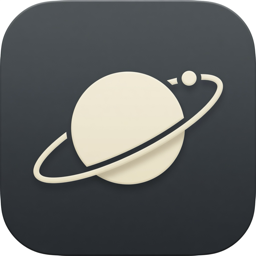

<div align="center">
  
  <h1>Orbit</h1>
  <p><strong>Private by default. File first. Agent ready.</strong></p>
  <p>생각은 가볍게 기록하고, 실행과 지식은 한곳에서 관리하는 개인용 워크스페이스.</p>
</div>

> [!IMPORTANT]
> Orbit은 아직 초기 개발 단계입니다. 현재 버전에는 자체 인증이 없으므로 공개 인터넷에 바로 노출하지 말고, 로컬 네트워크나 Cloudflare Access 같은 인증 프록시 뒤에서 사용하세요.

## Orbit이 해결하려는 문제

기존 지식 관리 도구는 사용자가 폴더, 데이터베이스, 속성, 자동화 규칙을 먼저 설계하도록 요구하는 경우가 많습니다. Orbit은 그 반대로 동작합니다.

1. 메모, 링크, 할 일, 일정을 형식 없이 Inbox에 기록합니다.
2. 원본은 사람이 읽을 수 있는 Markdown + YAML 파일로 남습니다.
3. Today에서 오늘의 실행 항목과 일정을 함께 봅니다.
4. 외부 에이전트는 MCP를 통해 같은 파일에 접근합니다.
5. AI 정리는 선택 기능이며, 향후 변경 제안을 사용자가 승인한 뒤 적용합니다.

## 지금 되는 것

- Markdown/YAML vault 읽기
- 메모, 할 일, 일정, 링크를 Inbox 파일로 캡처
- Inbox에서 Projects / Areas / Resources / Archive로 분류
- PARA 폴더 탐색과 폴더 안 노트 편집
- 오늘 할 일 계산 및 완료 처리
- 월간 캘린더와 일정 생성
- Markdown 노트 목록, 검색, 편집, GFM 미리보기, 태그, 보관
- Neutral 기반 shadcn/ui와 진회색 다크모드
- MCP capture / today / inbox / list / read / file / calendar / search
- `ORBIT_VAULT_DIR`로 앱 코드와 개인 vault 분리
- 모바일 대응 내비게이션

아직 없는 것: 로그인, AI 자동 분류, 변경 승인 화면, vault 전체 검색, CalDAV 동기화, Git 자동 백업, SSE 파일 감시. 범위와 순서는 [로드맵](./docs/roadmap.md)에 정리되어 있습니다.

## 빠른 시작

요구 사항: Node.js 22 이상, pnpm 10 이상

```bash
git clone https://github.com/kmelon55/orbit.git
cd orbit
pnpm install
cp .env.example .env
pnpm dev
```

기본 vault는 Git에서 제외되는 프로젝트의 `./vault`입니다. 실제 사용에서는 개인 데이터와 앱 코드를 완전히 분리하도록 `.env`에 절대 경로를 지정하세요.

```dotenv
ORBIT_VAULT_DIR=/absolute/path/to/orbit-vault
```

이전 `ORBIT_DATA_DIR`도 호환 목적으로 읽지만 새 설정에는 `ORBIT_VAULT_DIR`를 사용하세요.

## 파일 구조

```text
ORBIT_VAULT_DIR/
├── inbox/
├── projects/
├── areas/
├── resources/
├── events/
└── archive/
```

할 일은 별도 데이터베이스나 `tasks/` 폴더에 갇히지 않습니다. Inbox, Project, Area 안의 Markdown 파일이 `type: task`를 가지며, Orbit이 이를 Today에 모읍니다.

```markdown
---
id: 6c654756-053f-459a-9d73-c8a7c1ff020d
title: 첫 공개 릴리스 준비
type: task
space: project
project: Orbit
status: open
tags:
  - launch
created: 2026-08-23T09:00:00+09:00
updated: 2026-08-23T09:00:00+09:00
---

README와 기본 파일 계약을 검토한다.
```

전체 파일 계약은 [아키텍처 문서](./docs/architecture.md)를 참고하세요.

## MCP 연결

Orbit MCP 서버는 stdio로 실행됩니다.

```bash
ORBIT_VAULT_DIR=/absolute/path/to/orbit-vault pnpm mcp
```

MCP 클라이언트 설정 예시:

```json
{
  "mcpServers": {
    "orbit": {
      "command": "pnpm",
      "args": ["--dir", "/absolute/path/to/orbit", "mcp"],
      "env": {
        "ORBIT_VAULT_DIR": "/absolute/path/to/orbit-vault"
      }
    }
  }
}
```

Hermes에는 같은 stdio 서버를 붙이면 됩니다. `~/.hermes/config.yaml` 예시:

```yaml
mcp_servers:
  orbit:
    command: pnpm
    args: ["--dir", "/absolute/path/to/orbit", "mcp"]
    env:
      ORBIT_VAULT_DIR: "/absolute/path/to/orbit-vault"
```

캡처는 `orbit_capture`로 Inbox에만 넣고, 정리는 `orbit_file`로 Projects / Areas / Resources / Archive에 옮기는 흐름을 권장합니다.

## Docker / Dokploy

```bash
docker build -t orbit .
docker run --rm -p 3000:3000 \
  -e ORBIT_VAULT_DIR=/vault \
  -v orbit-vault:/vault \
  orbit
```

Dokploy에서는 GitHub 저장소와 배포 브랜치를 연결한 뒤 다음 값만 설정하면 됩니다.

- Build Type: `Dockerfile` (`Dockerfile`, context `/`)
- Volume Mount: `orbit-vault` → `/vault`
- Domain Container Port: `3000`
- Autodeploy: `On Push`

배포 디렉터리와 vault를 분리해야 재배포가 개인 파일에 영향을 주지 않습니다. 외부 공개 전에는 Dokploy Basic Auth나 Cloudflare Access 같은 인증 프록시를 반드시 구성하세요.

## 저장과 백업

GitHub API를 실시간 데이터베이스처럼 사용하지 않습니다. Orbit은 로컬 또는 서버 파일시스템의 vault를 유일한 원본으로 사용하고, Git과 S3 호환 스토리지는 비동기 백업 대상으로만 다룹니다.

- Git: Markdown 변경 이력과 사람이 읽을 수 있는 복구 지점
- S3 호환 스토리지: 삭제 방지 또는 불변 prefix를 사용하는 원격 스냅샷
- 애플리케이션: GitHub나 S3 장애와 관계없이 vault에서 계속 읽고 쓰기

파일 경로는 그대로 S3 object key로 옮길 수 있도록 `/` 구분자, NFC Unicode, 안전한 slug를 사용합니다. 권장 원격 prefix는 `vaults/<vault-name>/`입니다. 자세한 운영 방법은 [Vault와 백업 가이드](./docs/vault-and-backup.md)를 참고하세요.

## 개발

```bash
pnpm test       # Biome + TypeScript
pnpm build      # production build
pnpm mcp        # stdio MCP server
```

기여 방법은 [CONTRIBUTING.md](./CONTRIBUTING.md)를 참고하세요.

## 원칙

- 파일은 제품의 내보내기 형식이 아니라 Source of Truth입니다.
- SQLite는 검색 인덱스, 동기화 상태, 캐시처럼 재생성 가능한 데이터에만 씁니다.
- AI 제공자는 BYOK이며 AI 없이도 기본 기록과 실행 흐름이 동작해야 합니다.
- 에이전트의 파괴적인 변경은 기본적으로 제안 → 검토 → 적용 단계를 거칩니다.

## License

[MIT](./LICENSE)
